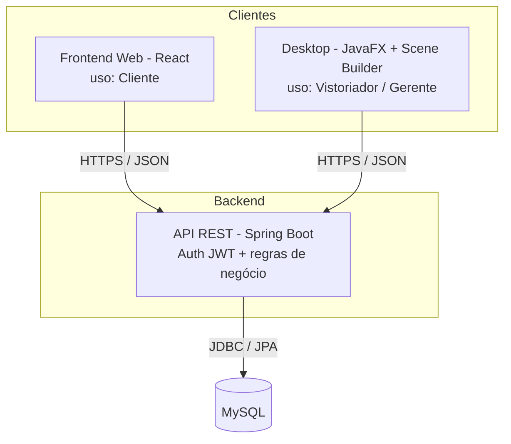
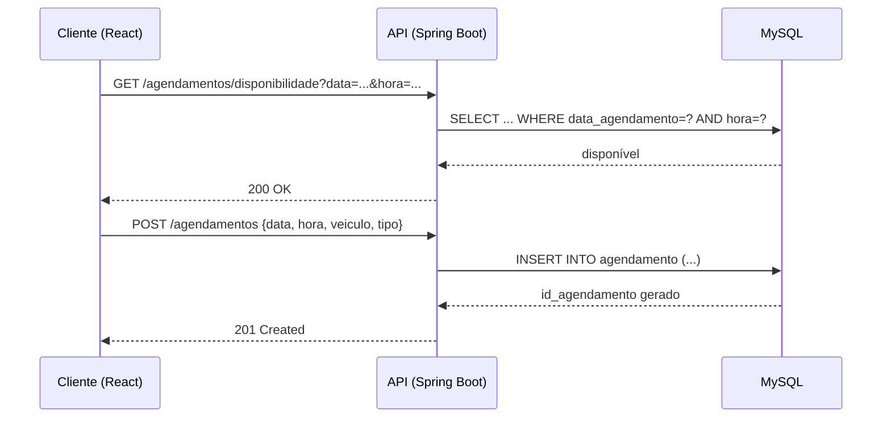

# Arquitetura Técnica — AutoVistor

## 1. Visão geral



Três repositórios independentes: `autovistor-backend`, `autovistor-web`, `autovistor-desktop`. Nenhum cliente acessa o banco diretamente — toda regra de negócio e toda credencial de banco ficam isoladas no backend.

## 2. Backend (Spring Boot)

### Camadas
```
backend/
├── entity/        → @Entity JPA (Cliente, Funcionario, Veiculo, Agendamento, Vistoria, Pagamento, Boleto, NotaFiscal, LancamentoCaixa, Laudo, DesligamentoFuncionario)
├── repository/     → JpaRepository<T, Long>
├── service/        → regras de negócio (validações, conflito de horário, geração de boleto/nf/caixa)
├── controller/      → @RestController (endpoints REST)
├── dto/             → objetos de entrada/saída (nunca expor @Entity direto)
├── security/        → JwtAuthFilter, UserDetailsService (diferencia Cliente x Funcionario)
├── exception/        → @ControllerAdvice (erros padronizados em JSON)
└── config/            → CORS, Swagger/OpenAPI, Flyway
```

### Segurança
- Login retorna JWT (`POST /auth/login`), token enviado no header `Authorization: Bearer ...`.
- Roles: `ROLE_CLIENTE`, `ROLE_VISTORIADOR`, `ROLE_GERENTE`.
- Senha com `BCryptPasswordEncoder`.
- Credenciais do banco via variável de ambiente (`SPRING_DATASOURCE_PASSWORD`), nunca no código.

### Principais endpoints
| Método | Rota | Quem acessa |
|---|---|---|
| POST | `/auth/login` | Todos |
| POST | `/clientes` | Público (autocadastro) e Gerente |
| GET/PUT | `/clientes/{id}` | Cliente (próprio), Gerente |
| POST | `/veiculos` | Cliente, Gerente |
| GET | `/veiculos/cliente/{id}` | Cliente (próprio), Gerente |
| POST/PUT/DELETE | `/agendamentos` | Cliente, Gerente |
| GET | `/agendamentos/disponibilidade` | Cliente (checagem antes de agendar) |
| POST | `/agendamentos/{id}/reagendar` | Cliente |
| POST | `/vistorias` | Vistoriador |
| GET | `/vistorias/designadas` | Vistoriador (agendamentos atribuídos a ele) |
| POST | `/pagamentos` | Vistoriador |
| POST | `/pagamentos/{id}/boleto` | Sistema/Vistoriador |
| GET | `/laudos/{idVistoria}` | Cliente (próprio), Vistoriador, Gerente |
| POST/PUT/DELETE | `/funcionarios` | Gerente |
| GET | `/relatorios/operacional` | Gerente |
| GET | `/relatorios/financeiro` | Gerente |

### Regra de negócio central corrigida
O `AgendamentoService` valida disponibilidade de horário consultando a `UNIQUE (data_agendamento, hora, id_funcionario)` antes de inserir — e propaga a violação como erro HTTP 409 (Conflict), que o front trata e oferece reagendamento. Isso resolve o bug do DF-Vistoria em que a checagem simplesmente não existia.

## 3. Desktop (JavaFX + Scene Builder)

- Telas desenhadas em **FXML** via Scene Builder, lógica em `Controller` (padrão *FXML Controller*, próximo de MVVM).
- Camada de acesso a dados: **nenhum DAO/JDBC** — um `ApiClient` (usando `java.net.http.HttpClient`) chama a API REST com o token JWT armazenado em memória após o login.
- Estrutura:
```
desktop/
├── view/          → arquivos .fxml
├── controller/     → controllers FXML (equivalente às antigas Views do Swing)
├── viewmodel/      → estado observável (Property/ObservableList) ligado ao FXML
├── client/         → ApiClient, DTOs de request/response
└── util/           → sessão do usuário logado, formatação
```
- `DatePicker` nativo substitui o JCalendar externo do DF-Vistoria; `TableView<T>` tipado substitui `JTable` + `DefaultTableModel`.

## 4. Frontend Web (React)

- Consome os mesmos endpoints REST, com o token JWT salvo em memória (não em `localStorage`, por segurança de XSS).
- Telas: cadastro/login, meus veículos, agendar vistoria, meus agendamentos (com opção de reagendar/cancelar), meus laudos, financeiro (boletos e status de pagamento).

## 5. Fluxo de dados: exemplo (agendar vistoria)

